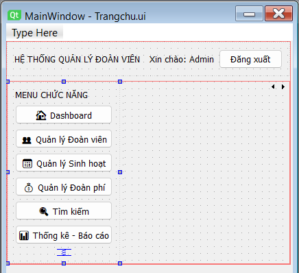
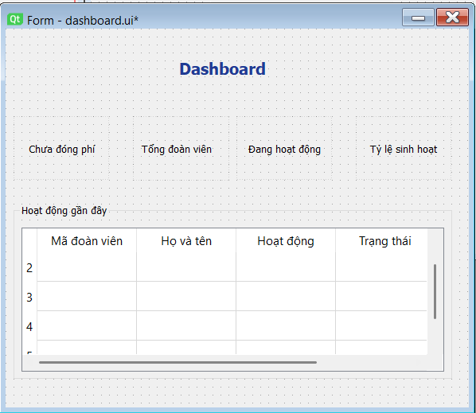
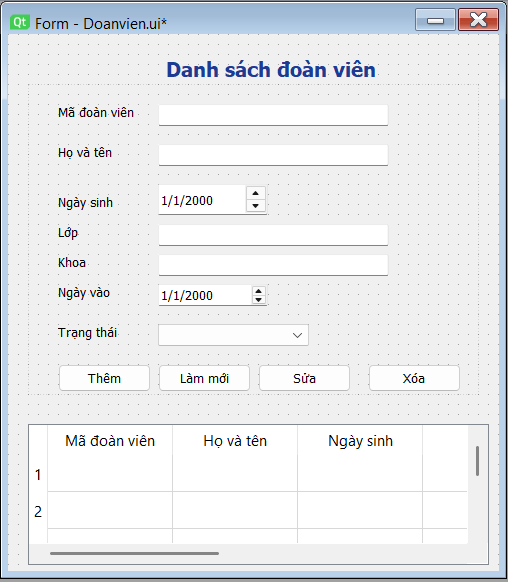
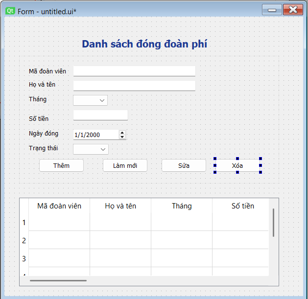

# HỆ THỐNG QUẢN LÝ ĐOÀN VIÊN

## Giới thiệu
Hệ thống quản lý đoàn viên là ứng dụng hỗ trợ quản lý thông tin đoàn viên, sinh hoạt đoàn và đoàn phí một cách hiệu quả, nhanh chóng và chính xác.

---

## Mục tiêu
- Quản lý thông tin đoàn viên
- Theo dõi sinh hoạt đoàn
- Quản lý đóng đoàn phí
- Thống kê và báo cáo
- Tìm kiếm nhanh dữ liệu

---

## Đối tượng sử dụng
- Cán bộ đoàn khoa / trường  
- Bí thư chi đoàn  
- Quản trị hệ thống  

---

## Chức năng chính

### 1. Dashboard
- Hiển thị tổng số đoàn viên  
- Số đoàn viên đang hoạt động  
- Số chưa đóng đoàn phí  
- Tỷ lệ tham gia sinh hoạt  
- Hoạt động gần đây  

---

### 2. Quản lý đoàn viên
- Thêm / sửa / xóa đoàn viên  
- Hiển thị danh sách  
- Tìm kiếm theo mã, tên, lớp  

**Thông tin gồm:**
- Mã đoàn viên  
- Họ tên  
- Ngày sinh  
- Lớp / khoa  
- Ngày vào đoàn  
- Trạng thái  

---

### 3. Sinh hoạt đoàn
- Tạo hoạt động  
- Cập nhật / xóa hoạt động  
- Điểm danh đoàn viên  
- Đánh giá tham gia  

---

### 4. Đoàn phí
- Thêm / sửa / xóa đóng phí  
- Theo dõi theo tháng  
- Lọc trạng thái  

**Thông tin:**
- Mã đoàn viên  
- Họ tên  
- Tháng  
- Số tiền  
- Ngày đóng  
- Trạng thái  

---

### 5. Tìm kiếm
- Tìm theo mã đoàn viên  
- Tìm theo họ tên  
- Tìm theo lớp / khoa  

---

### 6. Thống kê – báo cáo
- Thống kê theo tháng / năm  
- Tỷ lệ sinh hoạt  

---

### 7. Đăng xuất
- Thoát hệ thống  
- Quay về màn hình đăng nhập  

---

## Công nghệ sử dụng
- Python (PyQt5)
- SQLite (Database)
- Qt Designer (UI)

---
